# Тестовый проект по автоматизации UI тестирования на petrolplus.ru
<a href="https://www.petrolplus.ru/"></a>

## :point_up: Структура:

- <a href="#point_up_2-технологии-и-инструменты">Стек</a>
- <a href="#point_up_2-проведенные автотесты">Проведенные автотесты</a>
- <a href="#point_up_2-сборка-в-Jenkins">Сборка в Jenkins</a>
- <a href="#point_up_2-запуск-из-терминала">Запуск из терминала</a>
- <a href="#point_up_2-allure-отчет">Allure отчет</a>
- <a href="#point_up_2-интеграция-с-allure-testops">Интеграция с Allure TestOps</a>
- <a href="#point_up_2-интеграция-с-jira">Интеграция с Jira</a>
- <a href="#point_up_2-отчет-в-telegram">Отчет в Telegram</a>
- <a href="#point_up_2-видео-примеры-прохождения-тестов">Видео примеры прохождения тестов</a>

## :point_up_2: Стек
<p align="center">


</p>


## :point_up_2: Проведенные автотесты
- На функционала кнопки «Личный кабинет»
- На функционал кнопки «Оставить заявку»
- Переход на карту АЗС
- Тест функционала калькулятора:
  - Изменение полей «Типа машин» и «Количество машин»
  - Изменение Вида услуг
  - Нажатие на кнопку «Хочу так»

## :point_up_2: Сборка в Jenkins
[**Сборка в Jenkins**](https://jenkins.autotests.cloud/job/UI-petrolplus/)
<p>
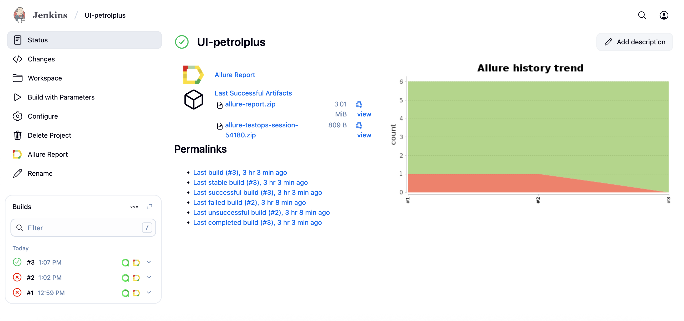
</p>

### Параметры сборки в Jenkins:
Сборка в Jenkins

- baseUrl(по умолчанию https://www.petrolplus.ru/)
- task (выбор групп тестов)
- webDriverHost (адрес удаленного сервера selenoid)
- browser (браузер, по умолчанию chrome)
- browserVersion (версия браузера, по умолчанию 127)
- browserSize (размер окна браузера, по умолчанию 1920x1080)

## :point_up_2: Запуск из терминала
Локальный запуск:
```
gradle clean mainPage
```
Удаленный запуск:
```
clean 
${TASK} 
-DbaseUrl=${BASE_URL}
-Dbrowser=${BROWSER}
-DbrowserVersion=${BROWSER_VERSION}
-DbrowserSize=${BROWSER_SIZE} 
-DwebDriverHost=${WEB_DRIVER_HOST}
```

## :point_up_2: Allure отчет

[Allure отчет](https://jenkins.autotests.cloud/job/UI-petrolplus/allure/)

- ### Главный экран отчета
<p>
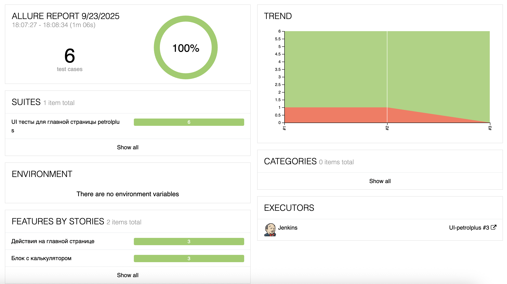
</p>

- ### Страница с проведенными тестами
<p>
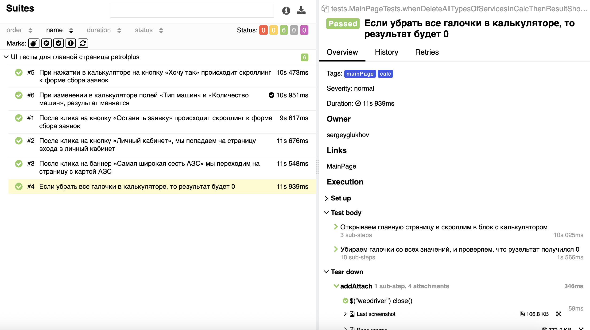
</p>

## :point_up_2: Интеграция с Allure TestOps

[Проект в Allure TestOps](https://allure.autotests.cloud/project/4926/dashboards)

- ### Экран с результатами запуска тестов
<p>
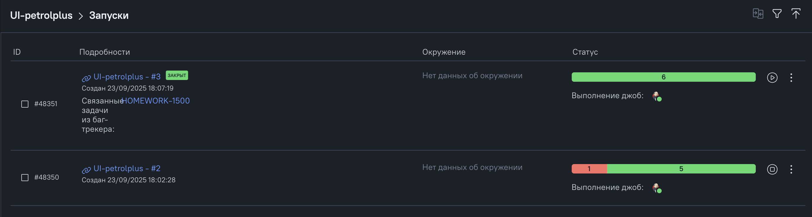
</p>

- ### Экран с дашбордами, включающие ручные и автотесты
<p>
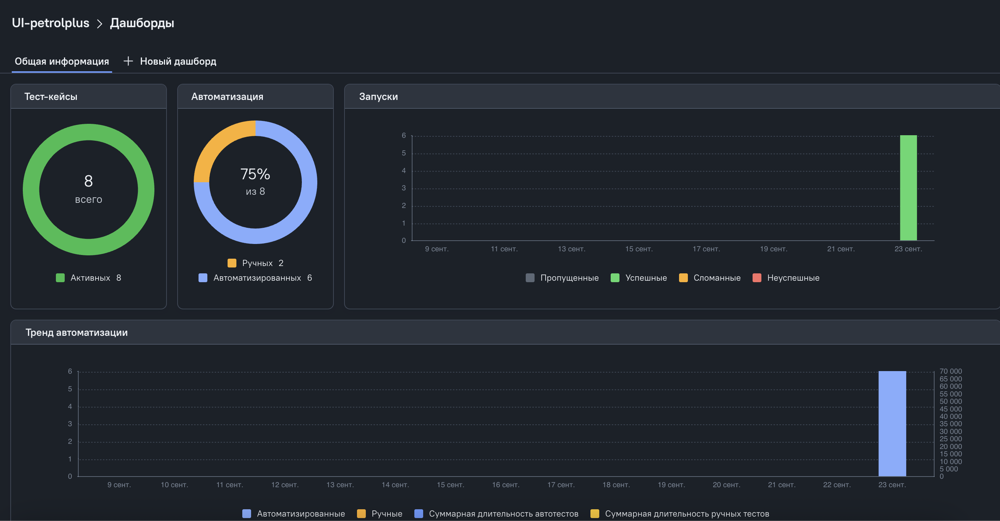
</p>

- ### Страница с ручными и автотестами в TestOps
<p>
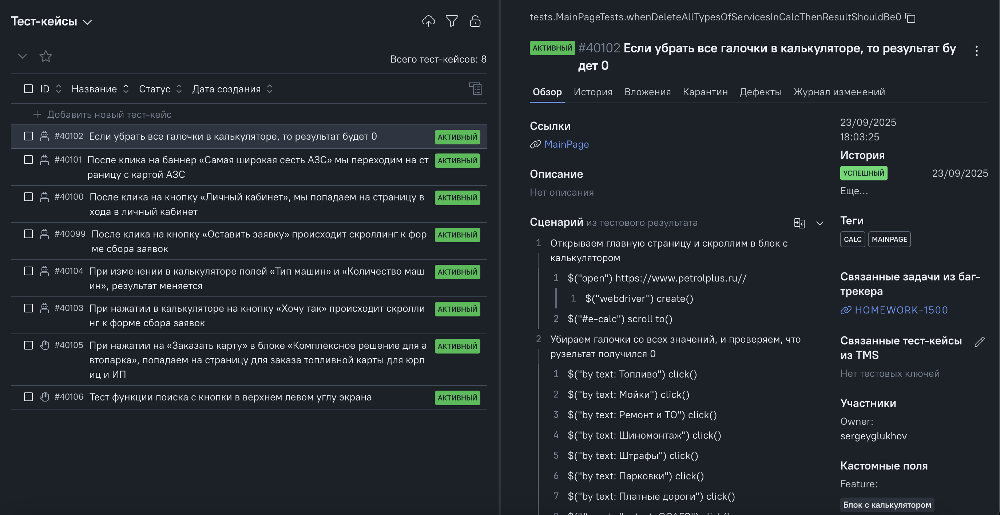
</p>

## :point_up_2: Интеграция с Jira

[Задача в Jira](https://jira.autotests.cloud/browse/HOMEWORK-1500)

- ### Страница с задачей в Jira
<p>
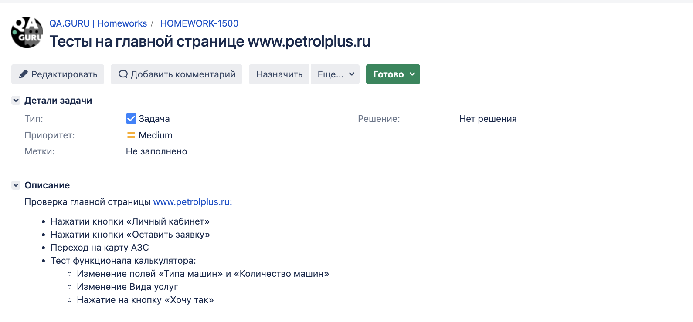
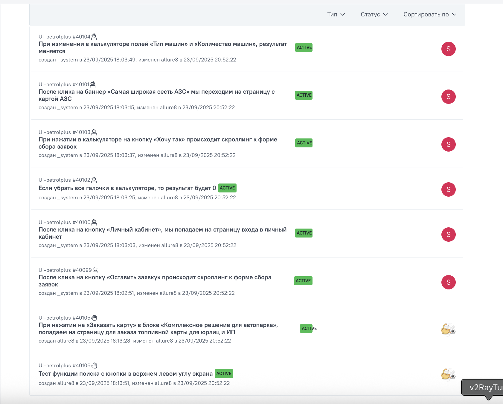
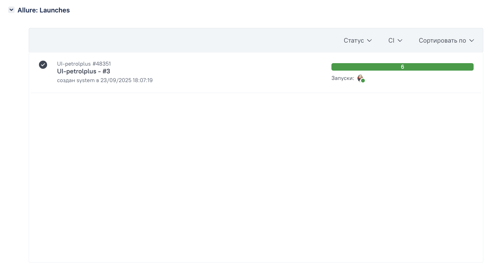
</p>

## :point_up_2: Отчет в Telegram
<p>
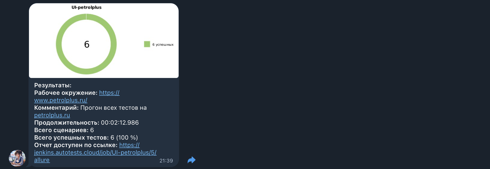
</p>

## :point_up_2: Видео примеры прохождения тестов
> К каждому тесту в отчете прилагается видео. Одно из таких видео представлено ниже.
<p>
  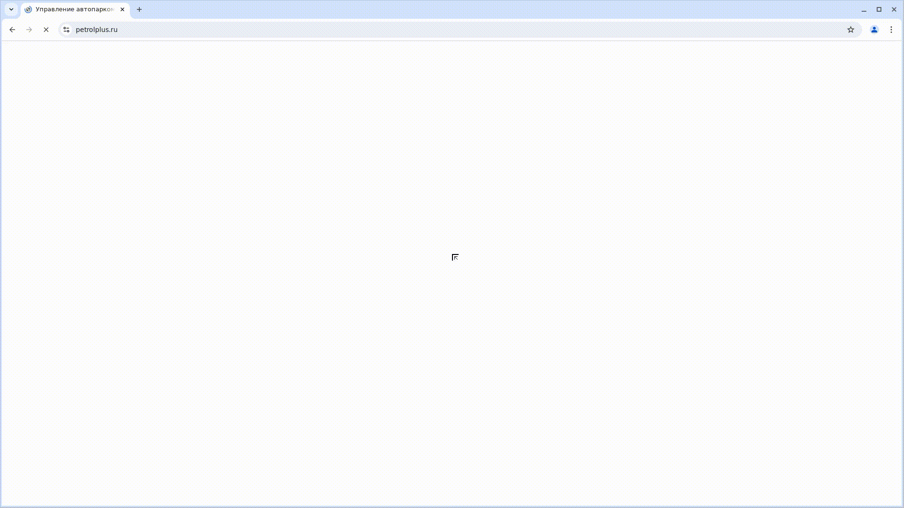
</p>